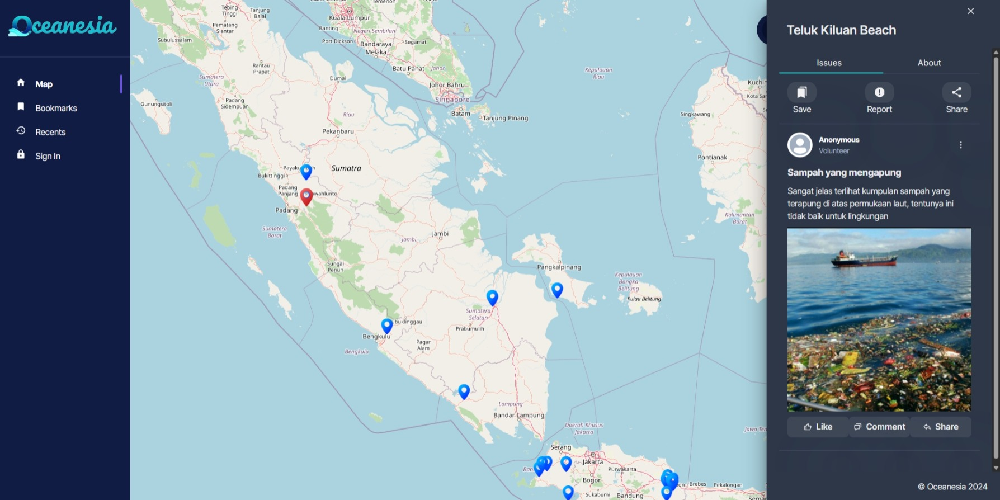

<div align="center" id="top">
    
</div>



Our team is carrying the 14th theme of the SDGS, where the theme is Life Below Water, where currently environmental issues are still one of the main focuses in the world, especially issues regarding the cleanliness of the sea and beaches for the survival of marine ecosystems and humans themselves. From this background, we want to help preserve the environment, especially in marine areas and beaches, then we named our project "OCEANESIA".
Oceanesia is a website based on maps or commonly referred to as "WEB GIS (Geographic Information System)".

## :dart: Project Overview

Oceanesia itself aims to help with the monitoring system, control cleanliness and can also report on the condition of the sea and beaches in an area. This is important because Indonesia is a maritime country where most of Indonesia's territory is sea and there are still many seas and beaches in Indonesia that are in poor condition. The presence of Oceanesia itself can make it easier for related agencies to map which areas should be the main focus in maintaining ocean cleanliness.

> **⚠️ IMPORTANT:**
> Key information users need to understand.

## :rocket: Main Technologies

<a href="https://react.dev/"> </a> <a href="https://www.python.org/"> </a> <a href="https://www.typescriptlang.org/"></a> <a href="https://nextjs.org"> </a> <a href="https://leafletjs.com/"> </a> <a href="https://v2.chakra-ui.com/"> </a> <a href="https://code.visualstudio.com/"> </a> <a href="https://flask.palletsprojects.com/"> </a> <a href="https://github.com/"> </a> <a href="https://swr.vercel.app/"> </a> <a href="https://shields.io/"> </a> <a href=""> </a> <a href="https://python-poetry.org/"> </a> <a href="https://supabase.com/"> </a>

<a href=""> )</a>
<a href=""> </a>

## :checkered_flag: Starting

```bash
# Clone this project
$ git clone https://github.com/IryIndriyanto/oceanesia-be

# Access
$ cd oceanesia-be

# Install dependencies
$ pip install Flask Flask-SQLAlchemy flask-smorest python-dotenv Flask-JWT-Extended passlib flask-migrate psycopg2 gunicorn flask-cors

# Run the project
$ flask run

# The server will initialize in the <http://localhost:5000>
```

## :file_folder: Folder Structure

```txt
OCEANESIA-BE
   |-- __pycache__
   |-- assets
   |   |-- HomePage.jpeg
   |   |-- logo.png
   |-- controllers
   |   |-- __pycache__
   |   |-- environment_data.py
   |   |-- issue.py
   |   |-- location.py
   |   |-- user.py
   |-- migrations
   |   |-- alembic.ini
   |   |-- env.py
   |   |-- README
   |   |-- script.py.mako
   |-- models
   |   |-- __pycache__
   |   |-- environment_data.py
   |   |-- issue.py
   |   |-- location.py
   |   |-- user.py
   |-- schemas
   |   |-- __pycache__
   |   |-- environment_data.py
   |   |-- issue.py
   |   |-- location.py
   |   |-- user.py
   |-- .flaskenv
   |-- .gitignore
   |-- .http
   |-- app.py
   |-- db.py
   |-- poetry.lock
   |-- pyproject.toml
   |-- README.md
   |-- wsgi.py
```

## :pen: Writer

| **Name**                    | **Role**               | **Email**                 | **GitHub**                                         |
| --------------------------- | ---------------------- | ------------------------- | -------------------------------------------------- |
| 1. `Iry Indriyanto`         | `Backend and Frontend` | `IryIndriyanto@gmail.com` | [Iry Indriyanto](https://github.com/IryIndriyanto) |
| 2. `Putri Noviani`          | `Frontend`             | `PutriNoviani@gmail.com`  | [Putri Noviani](https://github.com/PutriNoviani)   |
| 3. `Catur Ageng Pinaringan` | `Backend`              | `caturageng023@gmail.com` | [Catur Ageng](https://github.com/CaturAgeng)       |

<a href="#top">Back to top</a>
